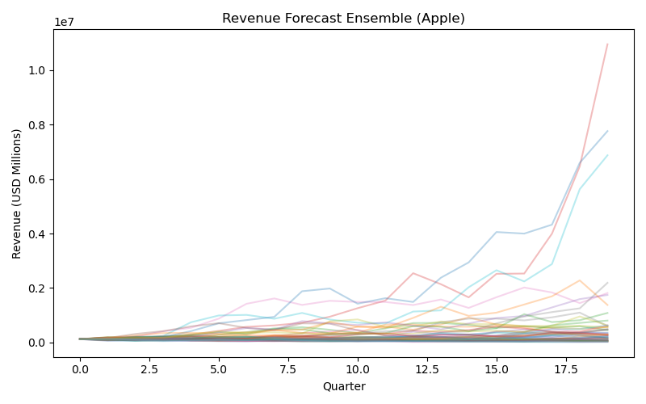
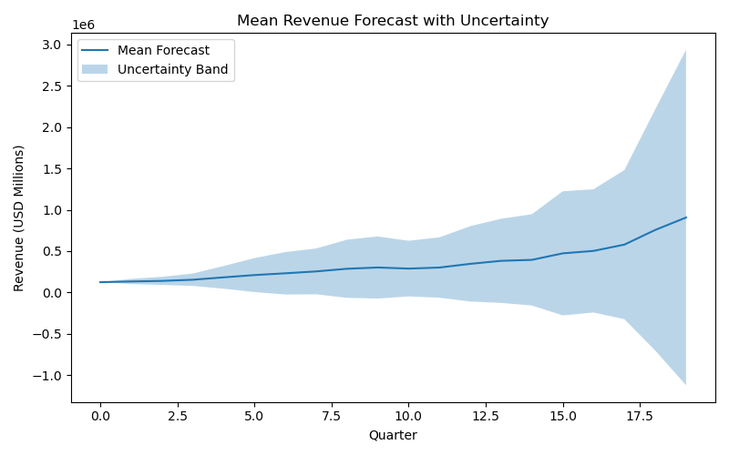
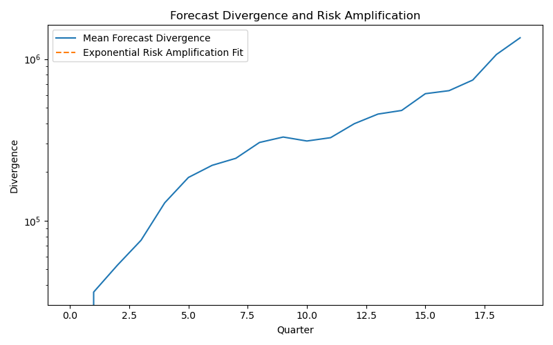

Revenue Forecast Risk Under Growth-Rate Uncertainty

This project investigates how uncertainty in revenue growth assumptions affects the reliability of long-term financial forecasts, using historical Apple (AAPL) quarterly revenue data as a real-world case study. Instead of producing a single point forecast, the analysis focuses on understanding the stability of revenue projections and identifying when forecast uncertainty overwhelms actionable signal. The central question addressed is not “What will revenue be?” but rather “How far into the future can a revenue forecast be trusted?”

Historical Apple revenue data is first analyzed to estimate baseline growth and volatility, which serve as inputs to a stochastic revenue growth model. Using these parameters, an ensemble of plausible future revenue trajectories is generated through Monte Carlo simulation, where each trajectory reflects a slightly perturbed but realistic growth assumption. This ensemble-based approach captures the sensitivity of revenue forecasts to small modeling errors and provides a framework for studying forecast uncertainty as a dynamic, time-evolving quantity.

Figure 1 (Revenue Forecast Ensemble) illustrates the ensemble of simulated revenue trajectories over the forecast horizon. While all trajectories begin from the same most recent observed revenue value, they diverge rapidly as time progresses. This dispersion highlights how even modest uncertainty in growth assumptions can lead to substantially different long-term revenue outcomes, despite identical starting conditions.

**Figure 1: Revenue Forecast Ensemble**  

To summarize ensemble behavior statistically, the mean forecast and standard deviation are computed at each time step. Figure 2 (Mean Revenue Forecast with Uncertainty) shows the ensemble mean along with an uncertainty band representing one standard deviation across scenarios. The widening uncertainty band demonstrates that forecast risk grows nonlinearly over time, indicating diminishing confidence in point estimates as the forecast horizon increases. This visualization makes clear that long-term revenue forecasts should be interpreted as ranges rather than precise values.

**Figure 2: Mean Revenue Forecast with Uncertainty**  

Beyond aggregate uncertainty measures, the project explicitly quantifies forecast disagreement by computing pairwise distances between revenue trajectories. These distances capture how quickly different plausible forecasts diverge from one another. Figure 3 (Forecast Divergence and Risk Amplification) plots the average divergence across all scenario pairs on a logarithmic scale, alongside an exponential fit. The near-linear behavior on the log scale indicates exponential growth in forecast divergence, allowing estimation of a risk amplification rate that characterizes how rapidly uncertainty compounds over time.

**Figure 3: Forecast Divergence and Risk Amplification**  

The exponential divergence observed in Figure 3 enables identification of forecast horizons beyond which revenue projections become dominated by uncertainty rather than informative signal. At these horizons, small modeling errors produce outcomes that differ by magnitudes large enough to undermine planning, budgeting, or strategic decision-making. This reinforces the core insight of the project: long-term financial forecasts are often structurally unstable, and their usefulness depends critically on the time scale over which decisions are being made.

Overall, this project reframes revenue forecasting as a problem of uncertainty propagation and risk management rather than pure prediction. By leveraging ensemble simulation, divergence analysis, and real financial data, the approach provides a principled way to assess forecast reliability and supports more risk-aware financial planning. While demonstrated using Apple revenue data, the methodology is broadly applicable to forecasting problems in corporate finance, FP&A, and strategic analysis where uncertainty plays a central role.